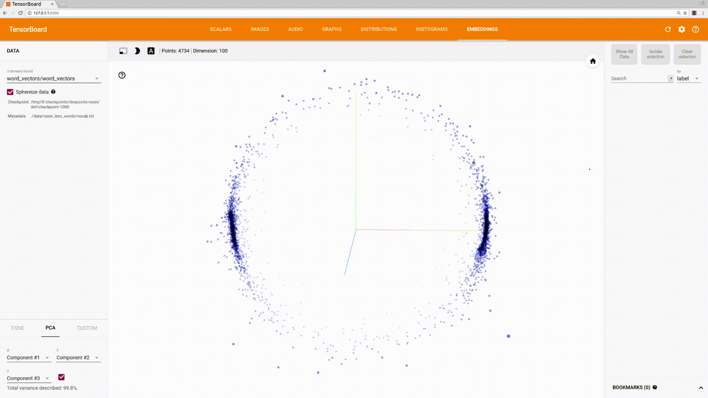

# `DeepScite` - A Simple Convolutional-based Recommendation Model


# Overview

DeepScite takes in papers (titles, abstracts) and emits recommendations on
whether or not they should be scited by the particular users whose data we've
used for training (in the case of this repo, it is [me](https://scirate.com/noonsilk)).

As output, it also gives a "goodness" score for each word; when this number is
high, it has contributed strongly to the paper being (recommended) for sciting,
when it is negative, it has contributed strongly to the paper *not* being recommended.

Below are some example outputs of the system:


The blue text are those words which are "good", and the red text are those which are "bad".


# Installation

1. Clone this repository:

  ```
  git clone https://github.com/silky/deep-scite.git
  ```

1. Use [conda](http://conda.pydata.org/docs/download.html) or (virtualenv) and
   create an environment that has Python 3.5.

   `conda create -n deep-scite python=3.5`

1. Activate the environment

    `source activate deep-scite`
    
1. Install TensorFlow (version `0.11`):

  Head over
  [here](https://www.tensorflow.org/versions/r0.11/get_started/os_setup.html#using-pip)
  and pick the version that is appropriate for your architecture.

1. Install the requirements

  `pip install -r requirements.txt`

1. Install `nltk` language packs

  In order to tokenise strings, we use the `nltk` package. It requires
  us to download some data before using it though. To do so, run:

  ````
  python -c 'import nltk; nltk.download("punkt")'
  ````

1. Install this library in `develop` mode

  `python setup.py develop`


# Usage

From the root directory of this project:

1. Activate the `deep-scite` environment

  `source activate deep-scite`

2. Train the model on the `noon` data set, and emit recommendations

  `./bin/run_model.py`

  This will run through the steps defined in `model.yaml`.

3. Open up `./data/noon/report.html` in your browser and observe recommendations.


# Misc

You can play around with the embedding by looking at it in TensorBoard. Run
TensorBoard with:

```
tensorboard --logdir /tmp/tf-checkpoints/deepscite-noon
```

Then click on the "Embedding" tab.

<a href="images/embedding.gif">

</a>
